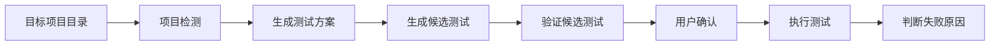
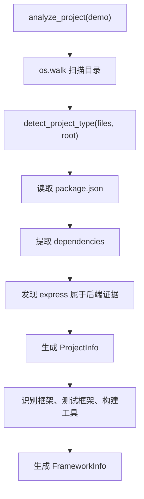

## `test-assistant` 的核心流程可以简化为:

`test-assistant` 的核心流程可以先简化为：





## 项目的代码地图

```text
cli/
  commands/
    init.py              用户执行 init 的入口
    run.py               用户执行测试的入口

core/
  models/                业务概念和合法值
    enums.py             项目类型、语言、测试框架
    project.py           FrameworkInfo

  analyzers/
    framework.py         读取目标项目并判断它是什么项目
    snapshot.py          记录文件状态
    source_analyzer.py   分析 Python 函数和类

  generators/
    test_generator.py    调用 LLM 生成测试

  executors/
    pytest_executor.py   执行 pytest
    vitest_executor.py   执行 vitest

  graphs/
    run_graph.py         把检测、生成和执行串联起来
```

## 项目检测的完整数据流

**当前检测流程可以概括为：**

```
扫描目录
→ 选择标志文件
→ 读取文件
→ 根据标志与依赖初步分类
→ 生成 ProjectInfo
→ 提取框架、测试框架、构建工具
→ 生成 FrameworkInfo
→ 包装为 AnalyzeInfo
```

**异常流程是：**

```
解析失败
→ ProjectDetectionError 或 PARSER_ERRORS
→ unknown_analysis
→ 返回可解释的 AnalyzeInfo
```


假设目标项目包含：

```text
demo/
├── package.json
└── src/
```
其中 `package.json` 是：
```json
{
  "dependencies": {
    "express": "^5.0.0"
  }
}
```
执行流程如下：

最终结果大致是：
```
FrameworkInfo(
    project_type=ProjectType.BACKEND,
    language=Language.JAVASCRIPT,
    frameworks=["Express"],
    test_frameworks=[],
    build_tools=[],
)
```

## ProjectInfo 和 FrameworkInfo 有什么区别

这是目前最容易混淆的地方。

### ProjectInfo：检测过程中的中间结果

```
ProjectInfo(
    project_type=ProjectType.BACKEND,
    language=Language.JAVASCRIPT,
    source_file="package.json",
    target_analysis="json",
    file_content="...",
)
```

它表达：

> 我通过哪个文件，初步判断这是什么项目，并保留后续解析需要的原始内容。

其中：

- `source_file`：依据来自哪个文件；
- `target_analysis`：应该用什么解析器；
- `file_content`：标志文件原始内容。

### FrameworkInfo：最终标准化结果

```
FrameworkInfo(
    project_type=ProjectType.BACKEND,
    language=Language.JAVASCRIPT,
    frameworks=["Express"],
    test_frameworks=[TestFramework.VITEST],
)
```

它表达：

> 完整分析后，这个项目具有什么属性。

可以记成：

```
ProjectInfo   = 检测过程中的证据
FrameworkInfo = 检测完成后的结论
```
