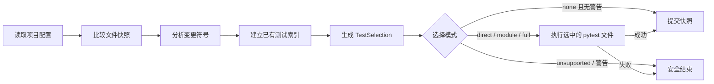
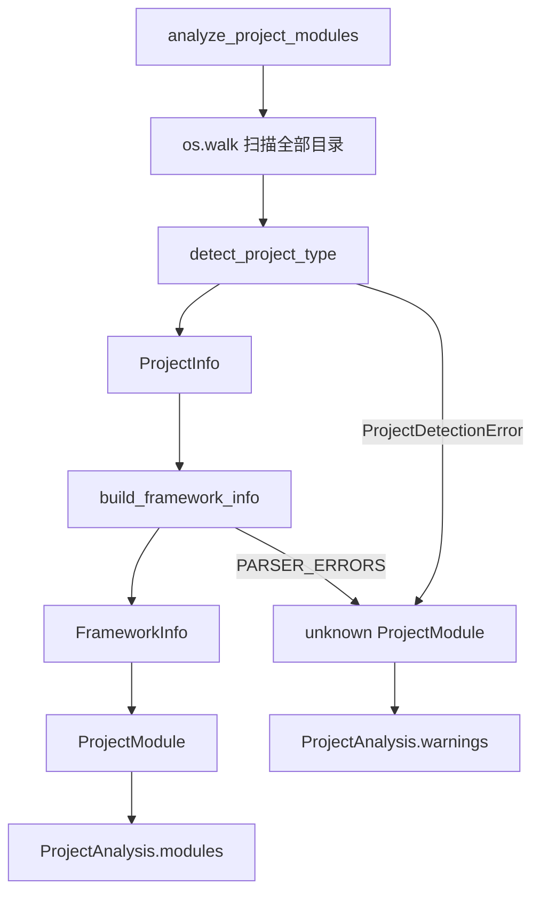

# test-assistant

`test-assistant` 当前的 M0 版本面向 Python + pytest 项目，提供可解释、可复现的增量测试选择与执行闭环。

## M0 核心流程



只有测试成功或确认没有需要执行的源码变化时，才会提交新的快照基线。分析失败、执行失败、不支持的项目和无映射源码不会被静默视为成功。

## 当前能力

- 支持根目录布局和 `src/` 布局的 Python 项目；
- 提取类、函数、方法及其模块限定名；
- 判断符号是否可直接测试、需要隔离或不适合作为直接入口；
- 提取 docstring 和类型提示等契约证据；
- 建立源码符号到已有 pytest 测试的直接映射；
- 对测试选择返回 `direct`、`module`、`full`、`none` 或 `unsupported`；
- 直接执行新增或修改的正式 pytest 文件；
- 只执行选中的测试文件，不遍历旧候选测试目录；
- 测试成功后原子提交快照，失败时保留旧基线；
- 测试环境默认关闭 LangSmith 网络追踪。

## 使用方式

项目初始化后，可以查看当前变化及选择依据：

```bash
poetry run test-assistant inspect --path .
```

输出包括：

- 项目语言和测试框架；
- 变更符号及可测性；
- 契约证据；
- 测试选择模式；
- 选中的测试文件；
- 选择证据和安全降级警告。

执行增量测试：

```bash
poetry run test-assistant run --path .
```

运行项目测试套件：

```bash
poetry run pytest -q
```

## 当前边界

- 符号级影响分析目前只支持 Python；
- 当前只建立可静态确认的直接测试映射；
- 删除 Python 源码或分析失败时会安全降级为正式 pytest 测试全集；
- 没有直接测试映射的源码会保留警告，等待后续 TestSpec 流程；

## 项目的代码地图

```text
cli/
  commands/
    init.py              用户执行 init 的入口
    run.py               用户执行测试的入口

core/
  models/                业务概念和合法值
    enums.py             项目类型、语言、测试框架
    project.py           FrameworkInfo

  analyzers/
    framework.py         读取目标项目并判断它是什么项目
    snapshot.py          记录文件状态
    source_analyzer.py   分析 Python 函数和类
    source.py            Python 符号、导入和测试索引
    contract.py          docstring 与类型提示契约证据
    impact.py            变更影响与 TestSelection

  generators/
    test_generator.py    旧生成器实验代码，未接入 M0 Graph

  executors/
    pytest_executor.py   执行 pytest
    vitest_executor.py   执行 vitest

  graphs/
    run_graph.py         串联检测、影响分析、执行和快照提交
```

## 项目检测的完整数据流

**当前检测流程可以概括为：**

```
扫描目录
→ 选择标志文件
→ 读取文件
→ 根据标志与依赖初步分类
→ 生成 ProjectInfo
→ 提取框架、测试框架、构建工具
→ 生成 FrameworkInfo
→ 包装为 AnalyzeInfo
```

**异常流程是：**

```
解析失败
→ ProjectDetectionError 或 PARSER_ERRORS
→ unknown_analysis
→ 返回可解释的 AnalyzeInfo
```


假设目录是：

```
demo/
├── frontend/
│   └── package.json
├── backend/
│   └── pyproject.toml
└── broken-worker/
    └── package.json
```

执行：

```
analysis = analyze_project_modules("/demo")
```


流程为：



最终结果类似：

```
ProjectAnalysis(
    root_path="/demo",
    modules=[
        ProjectModule(
            root_path="/demo/frontend",
            source_file="package.json",
            framework_info=FrameworkInfo(
                project_type=ProjectType.FRONTEND,
                language=Language.TYPESCRIPT,
            ),
        ),
        ProjectModule(
            root_path="/demo/backend",
            source_file="pyproject.toml",
            framework_info=FrameworkInfo(
                project_type=ProjectType.BACKEND,
                language=Language.PYTHON,
            ),
        ),
        ProjectModule(
            root_path="/demo/broken-worker",
            source_file="package.json",
            framework_info=FrameworkInfo(),
        ),
    ],
    warnings=[
        "broken-worker/package.json 解析失败：...",
    ],
)
```

计算整体类型时：

```
known_types = {
    ProjectType.FRONTEND,
    ProjectType.BACKEND,
}
```

unknown 模块被忽略，因此：

```
analysis.primary_type is ProjectType.MIXED
```


## ProjectInfo 和 FrameworkInfo 有什么区别

这是目前最容易混淆的地方。

### ProjectInfo：检测过程中的中间结果

```
ProjectInfo(
    project_type=ProjectType.BACKEND,
    language=Language.JAVASCRIPT,
    source_file="package.json",
    target_analysis="json",
    file_content="...",
)
```

它表达：

> 我通过哪个文件，初步判断这是什么项目，并保留后续解析需要的原始内容。

其中：

- `source_file`：依据来自哪个文件；
- `target_analysis`：应该用什么解析器；
- `file_content`：标志文件原始内容。

### FrameworkInfo：最终标准化结果

```
FrameworkInfo(
    project_type=ProjectType.BACKEND,
    language=Language.JAVASCRIPT,
    frameworks=["Express"],
    test_frameworks=[TestFramework.VITEST],
)
```

它表达：

> 完整分析后，这个项目具有什么属性。

可以记成：

```
ProjectInfo   = 检测过程中的证据
FrameworkInfo = 检测完成后的结论
```
