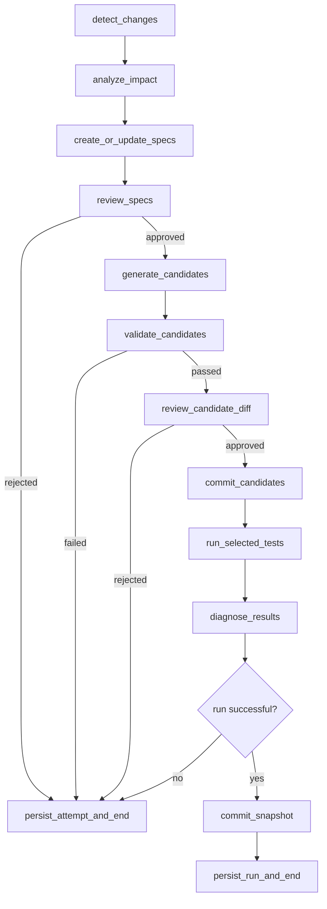

# test-assistant Python CLI 可信闭环实施路线图

> 状态：历史主路线图；v0.5.2 已完成，2026-08-04 之后的版本边界由 `docs/plans/2026-08-04-version-roadmap-v0.6-v1.0.md` 统一管理
> 制定日期：2026-07-27  
> 适用范围：当前仓库主线实现  
> 上位设计：`docs/plans/2026-07-20-auto-test-design-v2.md`

## 1. 文档目的

> **当前阅读提示：** 本文保留 v0.1～v0.5 的实施历史、架构原则和测试策略。关于 v0.6.0、v0.6.x、v0.7.0 与 v1.0.0 的当前范围、顺序和验收门，以新的统一版本路线图为准；本文中早期的 M3 候选和三天式 v1.0 估算不再作为执行计划。

本文档不替代产品与架构设计 v2，而是基于 2026-07-27 的真实代码状态，重新安排近期实施顺序。

产品设计 v2 继续回答：

> `test-assistant` 最终应具备哪些能力，以及为什么这样设计。

本文档回答：

> 从当前代码出发，如何尽快完成一个可安装、可验证、可安全试用的 Python + pytest CLI 版本。

路线图采用里程碑和验收门推进，不再用固定天数代表完成。未通过验收门的能力不能因为代码文件已经存在而标记为完成。

## 2. 核心判断

当前项目已经具备较好的分析底座，但还没有形成可信产品闭环。下一阶段不应继续横向扩展 Web、JS/TS、Agent 或更多测试类型，而应先完成以下最短价值链：

```text
初始化项目
→ 检测变更
→ 分析变更影响
→ 生成有证据的 TestSpec
→ 用户审阅 TestSpec
→ 生成候选测试
→ 验证候选测试
→ 用户审阅 diff
→ 提交正式测试
→ 执行受影响测试
→ 诊断失败
→ 成功后提交快照
```

首个可信版本限定为：

- Python 项目；
- pytest；
- 本地 CLI；
- 公共函数和可直接测试的类方法；
- 单元测试；
- docstring、类型标注、已有测试和显式 Schema 引用等契约证据；
- 确定性 LangGraph 工作流；
- 所有生成内容先进入候选区；
- 用户确认后才能进入正式测试目录。

## 3. 当前实现基线

### 3.1 已经具备

当前仓库已经实现或基本实现：

- Click CLI 与 `init`、`run` 等命令入口；
- Python、JavaScript/TypeScript、React、uni-app 等基础项目检测；
- 多模块项目证据收集；
- 版本化文件快照、差异比较和原子提交；
- Python AST 符号分析；
- 函数、类、方法、嵌套函数和异步函数识别；
- Python 签名、导入、相对导入和模块路径分析；
- 基础副作用识别与可测性分类；
- pytest 测试函数和测试类方法索引；
- 测试调用到源码符号的直接映射；
- docstring、类型标注、已有测试和 Schema 引用证据；
- pytest、Vitest 执行器及结构化执行结果；
- LangGraph 增量执行骨架；
- 初版 LLM 测试生成器；
- 初版 Python 直接影响分析。

### 3.2 部分实现但尚未形成能力

以下代码已经出现，但尚不能视为完成：

#### 影响分析

`analyze_impact_node` 和直接测试映射正在实现，但当前工作流没有完整接入该节点，`run_affected` 也没有真正消费 `affected_test_files`。

目前的粒度实际是：

```text
发生变化的 Python 文件
→ 文件中当前存在的全部符号
→ 直接调用这些符号的已有测试
```

它不是基于 Git diff 或新旧 AST 的精确 changed-symbol 分析。首版可以接受这种保守近似，但输出和文档必须如实说明。

#### 测试计划

当前 `plan` 命令生成的是测试框架建议，不是产品设计中的 `TestSpec`，也没有批准、拒绝和持久化状态迁移。

#### 测试生成

当前生成器可以调用 LLM 并写出 pytest 文件，但仍存在以下问题：

- 直接写入 `.autotest/test_cases/unit`；
- 未经过语法、导入、收集和隔离执行门禁；
- 文件名按 basename 生成，同名源码可能互相覆盖；
- 已计算 `module_path`，但 prompt 尚未实际使用；
- 没有从已批准 TestSpec 生成；
- 没有保存生成模型、模板版本、内容摘要和证据关联；
- 路径处理仍需统一为项目根目录下的绝对解析。

#### CLI

`inspect`、`generate`、`diagnose` 尚未实现，`status` 和 `watch` 仍是空壳。

### 3.3 当前验证状态

在 2026-07-27 的当前 shell 环境中执行默认 `pytest`，测试收集因缺少 `langchain_core` 和 `langgraph` 而失败。

这不直接证明代码行为失败，但说明以下验收项尚未满足：

- 干净环境安装方式明确；
- 依赖可复现；
- 默认测试命令可执行；
- CI 或等价验证能够证明主分支状态。

因此，恢复可复现验证环境是后续所有里程碑的入口条件。

## 4. 范围决策

### 4.1 首版保留

首个 Python CLI 可信版本必须保留：

- 项目检测与初始化；
- 文件快照和增量检测；
- Python 符号与契约证据分析；
- 已有 pytest 测试索引；
- 直接影响分析及明确降级策略；
- TestSpec；
- 候选测试存储；
- 静态与隔离执行门禁；
- 两阶段人工确认；
- pytest 执行；
- 五类失败诊断；
- 成功后快照提交；
- 可复现安装、测试和 smoke test。

### 4.2 首版延期

以下能力移到 Python CLI 可信闭环之后，不阻塞首版：

- FastAPI；
- React Dashboard；
- WebSocket/SSE；
- JavaScript/TypeScript 符号分析；
- Vitest 测试生成；
- Playwright 和 uni-app；
- watch 模式；
- `lessons.md` 自动学习；
- ReAct Agent；
- MCP；
- 多项目管理；
- 团队协作；
- 趋势报表；
- 大项目性能优化；
- 完整 SQLite 历史系统。

首版允许使用版本化 JSON 保存 TestSpec、候选状态、执行结果和诊断。领域模型稳定后再引入 SQLite，避免提前固化错误 schema。

### 4.3 版本与里程碑对应关系

当前 `pyproject.toml` 中的版本为 `0.1.0`。后续版本不再按“开发了多少天”升级，而按用户可验证的闭环能力升级：

| 版本 | 对应里程碑 | 版本定位 | 核心完成标志 |
| --- | --- | --- | --- |
| `v0.1.x` | 当前基线 | 内部开发版本 | 检测、快照、源码分析、执行器和初版生成器骨架 |
| `v0.2.0` | M0 | 可复现分析版 | 能解释项目、变更、符号、证据和应该运行的已有测试 |
| `v0.3.0` | M1 | 可信候选版 | TestSpec、两阶段审批、候选区和质量门禁形成闭环 |
| `v0.4.0` | M2 | 诊断候选版 | pytest 执行、五类诊断、状态和报告形成闭环 |
| `v0.5.0` | M3 | 真实项目分诊版 | 实例方法映射、结构化 suite 分诊、失败聚类、脱敏记录和 CLI |
| `v1.0.0` | M0～M2 + 发布门 | Python CLI 正式版 | 核心链路可安装、可恢复、可验证、可安全试用 |
| `v1.1+` | M3 增量扩展 | 反馈驱动版本 | Vitest、watch、历史或 Web 按真实需求逐项加入 |
| `v2.0.0` | 后续重大扩展 | 多语言/多运行时版本 | 多测试类型、受限 Agent 或协作模型形成稳定协议 |

版本规则：

- `v0.2.0`、`v0.3.0`、`v0.4.0` 都是可演示、可验收的版本，不是只有代码占位的版本；
- M0 未通过时不进入 `v0.3.0` 开发，M1 未通过时不进入 `v0.4.0` 开发；
- M2 通过不等于立刻发布 `v1.0.0`，还必须通过安装、CI、安全、文档和 smoke test 发布门；
- `v1.0.0` 的明确产品名称为 **test-assistant Python CLI**；
- Web、Vitest 和 Agent 不属于 `v1.0.0` 的完成条件；
- 后续如果改变 `v1.0.0` 范围，必须同步修改本文档和上位设计，不能只修改版本号。

## 5. 目标架构边界

### 5.1 Core 与 CLI

CLI 只负责：

- 参数解析；
- 交互确认；
- 结果展示；
- 退出码。

所有业务状态迁移放在 `core`：

```text
core/
  analyzers/       项目、源码、契约、变更和影响分析
  planners/        TestSpec 创建和状态迁移
  generators/      从批准 TestSpec 生成候选测试
  validators/      候选测试质量门禁
  executors/       正式测试与隔离测试执行
  diagnosticians/  失败分类和证据
  storage/         JSON/后续 SQLite 持久化
  workflows/       跨生成、验证、审批和提交的确定性应用工作流
  graphs/          固定工作流编排
```

CLI 和未来 Web 必须调用同一套 core 服务，不能复制状态迁移逻辑。

### 5.2 正式测试与候选测试

候选测试和正式测试必须物理分离：

```text
.autotest/
├── plans/
│   └── <plan-id>.json
├── candidates/
│   └── <plan-id>/<source-relative-path>/test_<name>.py
├── test_cases/
│   └── unit/<source-relative-path>/test_<name>.py
├── results/
└── snapshot.json
```

LLM 只能写入 `candidates/`。验证器只能读取候选并产生结构化结果。只有提交服务可以在用户批准后写入 `test_cases/`。

### 5.3 TestSpec 是业务中心

测试代码不是第一等业务对象，TestSpec 才是。

最小模型应包含：

```python
class TestSpec:
    id: str
    target_symbol: str
    behavior: str
    arrange: dict
    action: str
    expected: dict
    evidence: list[ExpectationEvidence]
    side_effects: list[str]
    status: str  # proposed | approved | rejected
```

约束：

- 没有证据的 expected 必须标记为弱推断；
- 仅由当前实现推断的 expected 可以生成回归测试，但不能独立证明产品缺陷；
- rejected TestSpec 不能进入生成器；
- TestSpec 状态必须持久化；
- 同一输入重复执行状态迁移必须幂等。

## 6. 目标工作流

### 6.1 主流程



### 6.2 影响分析降级

影响分析必须返回结构化选择结果，而不是只有测试文件列表：

```python
class TestSelection:
    mode: str  # direct | module | full | none | unsupported
    test_files: list[str]
    evidence: list[str]
    warnings: list[str]
```

首版规则：

1. 找到直接测试映射：运行直接相关测试；
2. 源码有变更但没有已有测试映射：创建 TestSpec，不解释为“无需运行”；
3. 删除文件、语法损坏或分析失败：降级到模块级或全量测试；
4. 非 Python 项目：返回 `unsupported`，不静默成功；
5. 无有效源码变更：返回 `none`，不调用 LLM；
6. 任何降级必须向用户展示原因。

### 6.3 快照提交

只有满足以下条件才能提交新快照：

- 本次状态已经持久化；
- 所有批准候选已经原子提交；
- 选中的测试已经执行；
- 没有测试失败；
- 没有 Runner 或环境故障；
- 没有未处理的候选验证失败。

用户拒绝、LLM 失败、候选非法、测试失败和环境失败均保留旧快照，以便下一次仍能检测到相同变更。

## 7. 里程碑

### M0：可复现分析闭环

#### 目标

证明工具能够稳定、可解释地回答：

> 项目是什么、发生了什么变化、哪些符号受影响、有哪些契约证据、应该运行哪些已有测试。

#### 工作项

1. 固定安装和测试入口；
2. 验证依赖锁定与 Python 版本；
3. 全量测试在干净环境通过；
4. 将 `analyze_impact_node` 接入 Graph；
5. 让执行节点消费结构化 TestSelection；
6. 实现影响分析的降级策略；
7. 实现最小 `inspect`；
8. 用 fixture 项目完成真实分析演示；
9. 更新 README，使命令和实际能力一致。

#### 验收标准

- `pytest` 默认命令无收集错误且全部通过；
- `test-assistant init` 可初始化 Python fixture；
- `test-assistant inspect` 展示模块、符号、证据、可测性和警告；
- 修改一个已有测试覆盖的函数后，只选择直接关联测试；
- 修改一个没有测试的函数后，明确返回“需要创建 TestSpec”；
- 分析失败时明确降级，不返回假成功；
- 无变更时不调用 LLM，不执行测试；
- 运行失败时不提交快照；
- 成功后再次运行得到零变更。

### M1：可信候选闭环

#### 目标

证明工具能够安全生成测试，但不能越过用户和质量门禁。

#### 工作项

1. 实现 TestSpec、ExpectationEvidence 和状态模型；
2. 实现 Planner；
3. 将当前“测试框架建议”与 TestSpec 计划拆分；
4. 实现 `plan list/show/approve/reject`；
5. 实现候选分层存储；
6. 让生成器只接受 approved TestSpec；
7. 修复模块导入路径上下文；
8. 增加生成模型、模板版本和内容摘要；
9. 实现静态门禁；
10. 实现隔离执行门禁；
11. 实现候选 diff 审阅；
12. 实现批准后的原子提交和冲突保护。

#### 门禁顺序

```text
非空与输出结构
→ Python AST 语法
→ import 路径
→ pytest collect-only
→ Runner 健康检查
→ 临时目录隔离执行
→ 副作用与不稳定性检查
→ 候选 diff
```

#### 验收标准

- 每个 TestSpec 都关联目标符号和证据；
- 无证据预期被标记为弱推断；
- 未批准 TestSpec 不调用生成器；
- LLM 输出只能写入候选区；
- 同名源文件不会覆盖候选；
- 非法候选不能进入正式目录；
- 用户拒绝后目标项目正式文件不变；
- 已有人工测试默认不覆盖；
- 批准提交使用原子写入；
- fake LLM 可完整覆盖集成测试，不依赖真实网络。

### M2：执行与诊断闭环

#### 目标

证明工具不会把所有失败都误判为业务缺陷，并能提供可审计建议。

#### 工作项

1. 实现 `diagnose` 领域模型和 CLI；
2. Runner 健康检查；
3. 单测试隔离重跑；
4. 必要时重复运行识别 Flaky；
5. 关联 TestSpec 的预期证据；
6. 保存环境、Git SHA、依赖摘要和测试摘要；
7. 生成分类、置信度、证据和建议动作；
8. 实现最小 `status` 和 Markdown 报告；
9. 完成发布 smoke test。

#### 分类

| 分类 | 首版判断边界 |
| --- | --- |
| `PRODUCT_DEFECT` | 强契约预期未满足，且测试和 Runner 均有效 |
| `TEST_DEFECT` | 测试语法、导入、Mock、Fixture 或断言依据存在问题 |
| `INFRA_DEFECT` | Runner、依赖、权限、超时或环境不可用 |
| `FLAKY` | 相同输入与环境下重复执行结果不一致 |
| `INCONCLUSIVE` | 证据不足、证据冲突或无法可靠区分 |

#### 验收标准

- 语法错误不会被报告为产品缺陷；
- Runner 缺失不会被报告为测试失败；
- 稳定断言失败和 Flaky 展示不同结果；
- 仅有当前实现推断时不能判定 `PRODUCT_DEFECT`；
- 每个诊断包含证据、置信度和建议；
- 系统不能通过删除、跳过或削弱断言制造通过；
- 完整 fixture 流程可复现：

```text
detect
→ impact
→ plan
→ approve
→ generate
→ validate
→ approve diff
→ commit
→ run
→ diagnose
→ snapshot
```

M2 完成后，项目可以发布为首个 Python CLI Beta。

完成 M2 后先发布或标记 `v0.4.0` 候选版；只有继续通过发布门，才升级为 `v1.0.0` 正式版。

### M3：基于反馈扩展

> 本节为历史候选池。当前已选定 coverage/Ruff/mypy 作为 v0.6.0，兼容性、规模化和安全发布的顺序见 2026-08-04 统一版本路线图。

M3 不预先固定完整实施顺序。完成 M2 并获得真实使用反馈后，在以下方向中选择收益最高的一项：

1. JavaScript/TypeScript + Vitest；
2. FastAPI + React Dashboard；
3. watch 模式；
4. SQLite 历史和趋势；
5. 覆盖率与变异测试优先级；
6. 安全的受限 Agent 工具调用；
7. Playwright 或 uni-app 专用执行能力。

所有扩展必须复用：

- TestSpec；
- 证据强度；
- 候选区；
- 质量门禁；
- 用户确认；
- 执行结果协议；
- 五类诊断；
- 快照提交规则。

任何扩展不得绕过这些边界。

## 8. 立即执行顺序

从当前工作区继续开发时，建议严格按以下顺序：

1. 恢复项目依赖并取得完整测试基线；
2. 完成当前影响分析代码及测试；
3. 将影响节点接入 Graph；
4. 修改执行节点，使其真正运行选中的已有测试；
5. 定义无映射、删除文件和分析失败的降级行为；
6. 实现 `inspect` 并完成 M0 fixture 演示；
7. 通过 M0 验收后再创建 TestSpec 模型；
8. TestSpec 审批稳定后重写生成器；
9. 候选门禁稳定后实现正式提交；
10. 最后实现诊断和发布。

### 8.1 每日实施计划

以下是基于当前代码状态估算的 30 个有效工作日计划。这里的 Day 表示开发顺序，不代表不可调整的日历日期。

统一规则：

- 每天只在当天完成标准满足后结束该项；
- 未完成任务顺延，后续 Day 编号整体后移；
- 不允许用降低测试、删除断言或跳过错误的方式满足完成标准；
- 每个版本验收日必须运行全量测试和 fixture 演示；
- 真实 LLM 调用不是默认测试通过的前提；
- 发现架构问题时优先记录 ADR，不在日计划中静默扩大范围。

#### v0.2.0 / M0：可复现分析版（Day 1～9）

| Day | 主题 | 主要工作 | 当日完成标准 |
| ---: | --- | --- | --- |
| 1 | 环境基线 | 确认 Python 版本、依赖安装方式、锁文件和默认测试入口 | 干净环境能够安装依赖并开始收集测试 |
| 2 | 测试基线 | 运行全量测试，分类代码失败、依赖失败和环境失败 | 默认 `pytest` 全部通过，或每个剩余失败都有明确阻塞记录 |
| 3 | 影响分析收口 | 完成变更文件到当前符号、已有测试映射及去重 | 直接映射、无映射、非 Python 文件测试通过 |
| 4 | TestSelection | 引入 `direct/module/full/none/unsupported` 结构化选择模型 | 所有选择分支有证据、警告和确定性序列化 |
| 5 | Graph 接线 | 将 `analyze_impact_node` 接入实际 Graph | Graph 顺序包含 detect → impact，所有分支有限结束 |
| 6 | 受影响执行 | 让执行节点只消费 TestSelection，不再默认遍历所有候选测试 | 直接模式只运行选中测试，执行失败不提交快照 |
| 7 | 安全降级 | 处理删除文件、语法损坏、无映射、分析异常和非 Python 项目 | 每种情况返回明确降级结果，不静默成功 |
| 8 | inspect | 实现最小 `inspect`，展示模块、符号、证据、可测性和选择结果 | 用户能够解释“为什么选择这些测试” |
| 9 | M0 验收 | 完成根布局和 `src/` 布局 fixture 集成演示，更新 README | M0 全部验收标准通过，版本可标记为 `v0.2.0` |

#### v0.3.0 / M1：可信候选版（Day 10～20）

| Day | 主题 | 主要工作 | 当日完成标准 |
| ---: | --- | --- | --- |
| 10 | TestSpec 模型 | 建立 TestSpec、ExpectationEvidence、状态和校验规则 | 模型稳定序列化，无证据预期明确标为弱推断 |
| 11 | 计划存储 | 实现版本化 JSON repository、ID、原子写入和幂等状态迁移 | 重启后状态恢复，重复批准/拒绝结果确定 |
| 12 | Planner | 从目标符号、可测性和契约证据生成结构化 TestSpec | fake LLM 的合法、非法和空输出均有结构化结果 |
| 13 | plan CLI | 拆分框架建议，实现 list/show/approve/reject | 未批准 TestSpec 无法进入生成器 |
| 14 | 生成器 v2 | 只从 approved TestSpec 生成，补全模块路径和禁止行为 | prompt 包含目标、证据、模块路径和安全边界 |
| 15 | 候选存储 | 实现分层路径、内容摘要、模板版本和冲突检测 | 同名源码不覆盖，LLM 只能写候选区 |
| 16 | 静态门禁 I | 实现非空、输出结构和 Python AST 语法检查 | 空文本、说明文字、多代码块和非法语法被正确拒绝 |
| 17 | 静态门禁 II | 实现 import 检查和 `pytest --collect-only` | 导入错误与收集错误返回不同结构化结果 |
| 18 | 隔离门禁 | 实现 Runner 健康检查、临时目录执行、超时和副作用结果 | 环境故障与候选测试失败可以区分 |
| 19 | diff 与提交 | 实现候选 diff、二次批准、原子提交和人工文件保护 | 未批准不落盘，冲突不覆盖，失败可恢复 |
| 20 | M1 验收 | 完成 plan → approve → generate → validate → approve diff → commit 演示 | M1 全部验收标准通过，版本可标记为 `v0.3.0` |

##### Day 20 实施记录（2026-07-31）

已完成 Core 层可信候选工作流编排：

- `prepare_candidate_for_review()` 负责从已批准 `TestSpec` 生成候选测试；
- 候选依次经过输出结构、AST、import、pytest 收集、Runner 健康检查和隔离执行门禁；
- 隔离执行产生的文件副作用必须由 `TestSpec.side_effects` 显式声明；
- 验证成功后只生成 `CandidateDiff`，不会写入正式测试目录；
- `commit_reviewed_candidate()` 只接受用户已经审阅的 `CandidateDiff`；
- 提交前重新验证 diff 和内容摘要，过期 diff、候选变化及正式文件冲突均拒绝提交；
- 正式文件通过临时文件、`fsync` 和原子创建或替换完成提交。

自动化验收覆盖：

- 未批准计划在生成前短路；
- 静态验证失败；
- pytest 收集失败；
- Runner 健康检查失败；
- 隔离执行测试失败；
- 未声明与已声明的文件系统副作用；
- 成功生成 diff 且正式目录保持不变；
- 人工确认后的成功提交；
- 过期 diff 拒绝；
- 提交阶段文件系统错误。

验证结果：

```text
poetry run pytest tests/test_candidate_workflow.py -q
12 passed

poetry run pytest tests/test_cli_generate.py -q
6 passed

poetry run pytest -q
336 passed
```
当前状态：

- Day 20 Core 编排和自动化测试完成；
- CLI 已完成
  `plan approve → generate → validate → review diff → commit`
  的 fixture 垂直闭环演示；
- CLI 演示使用 fake LLM 和真实 pytest 门禁，不依赖外部网络；
- 用户拒绝时正式测试保持不变，用户确认后才执行原子提交；
- M1 全部验收标准通过，当前代码具备标记为 `v0.3.0`
  可信候选版的条件。

#### v0.4.0 / M2：执行诊断版（Day 21～27）

| Day | 主题 | 主要工作 | 当日完成标准 |
| ---: | --- | --- | --- |
| 21 | 诊断模型 | 建立五类诊断、证据、置信度、位置和建议模型 | 每个分类可序列化，证据不足默认 `INCONCLUSIVE` |
| 22 | 执行预检 | 完善 Runner 健康检查、退出码、超时、无收集和环境摘要 | Runner 故障不会被报告为产品缺陷 |
| 23 | 隔离与 Flaky | 单独重跑失败测试，必要时重复运行识别不稳定性 | 稳定失败和 Flaky fixture 得到不同诊断 |
| 24 | 证据归因 | 将失败与 TestSpec、契约强度、测试门禁和目标位置关联 | 只有强证据满足时才允许 `PRODUCT_DEFECT` |
| 25 | diagnose/status | 实现最小 `diagnose`、`status` 和可复现命令输出 | CLI 不只显示 passed/failed，能够解释原因 |
| 26 | 报告与持久化 | 保存执行、诊断、环境、Git 和依赖摘要，生成 Markdown 报告 | 失败后可复查，报告不泄漏密钥或无关源码 |
| 27 | M2 验收 | 完成成功、测试缺陷、环境故障、稳定失败和 Flaky fixture 演练 | M2 全部验收标准通过，版本可标记为 `v0.4.0` |

#### v1.0.0：Python CLI 发布门（Day 28～30）

> 历史估算，已被 `docs/plans/2026-08-04-secure-release-v1.0.0.md` 的可执行安全发布计划取代。

| Day | 主题 | 主要工作 | 当日完成标准 |
| ---: | --- | --- | --- |
| 28 | 安全与恢复 | 检查路径穿越、Prompt 注入、敏感信息、原子写入和失败恢复 | 恶意源码不能改变权限边界，失败不污染正式测试和快照 |
| 29 | 发布工程 | 完善 CI、包配置、版本、CLI help、README、限制说明和发布说明 | 干净环境安装后所有默认测试与 smoke test 通过 |
| 30 | v1.0 验收 | 完整执行两阶段人工确认和五类诊断场景矩阵 | 所有统一完成定义满足，才能发布 `v1.0.0` |

### 2026-07-31 M2 实施记录

- Day 21：完成五类诊断、置信度、证据、位置和建议动作领域模型。
- Day 22：完成 pytest Runner 预检、退出码、超时、无收集和环境摘要。
- Day 23：完成失败节点三次受控复跑以及同环境 Flaky 判定。
- Day 24：完成 TestSpec、契约强度、测试门禁、目标位置和重复执行的证据归因；只有已批准强契约满足全部条件时允许 `PRODUCT_DEFECT`。
- Day 25：完成最小 `diagnose`、`status` 和可复现命令输出。
- Day 26：完成版本化诊断 JSON、原子写入、latest 记录、Git/依赖/环境摘要和脱敏 Markdown 报告。
- Day 27：M2 全量回归通过，版本进入 `v0.4.0` 候选阶段。
- Day 28～30：增加构建验证和 CI，更新 README，移除未实现的 Web/监听空命令。正式发布和 Git 标签仍需在远端 CI 与干净环境安装验收后由维护者执行。
- 2026-08-01：补齐 `plan propose` 与确定性 `verify`，形成 propose → approve → generate → diff confirm → 三次精确复跑 → diagnose/status/report 的端到端 CLI；成功验证状态与失败诊断历史分开保存。
- 2026-08-01：完成 `v0.5.0` 真实项目分诊：`self.service.method()` 映射、符号级 snapshot、pytest hook JSON、稳定失败聚类、三次代表 node 复跑、五类归因、脱敏 triage repository 与 `triage` CLI。真实 `fitstyle-backend` 只读 smoke 成功选择 `tests/test_cold_start_service.py`。

### 8.2 日计划调整原则

30 日是当前规模下的实施估算，不是发布时间承诺。出现以下情况时应调整：

- 如果 Day 1～2 无法取得绿色基线，暂停新增功能，先解决可复现性；
- 如果影响分析需要跨模块调用图，首版先安全降级，不临时扩大为全语言静态分析项目；
- 如果 TestSpec 模型在 Day 12～14 频繁变化，延后候选存储和数据库设计；
- 如果隔离执行无法可靠区分环境故障，M1 不得通过；
- 如果五类诊断准确率不足，默认增加 `INCONCLUSIVE`，不得用高置信度包装猜测；
- 如果真实用户在 M1 后反馈核心流程不可理解，可优先改善 CLI 交互，但仍不启动 Web；
- 任一里程碑超期不影响版本定义，只影响预计日期。

在第 6 步完成之前，不开始：

- Web；
- Vitest 生成；
- watch；
- Agent；
- 自动学习；
- 完整历史数据库。

## 9. 测试策略

### 9.1 单元测试

覆盖：

- 路径和模块名解析；
- 符号与证据提取；
- TestIndex；
- TestSelection；
- TestSpec 状态迁移；
- 候选路径映射；
- 门禁结果；
- 诊断评分；
- Graph 路由。

### 9.2 契约测试

固定：

- LLM 结构化输出；
- pytest collect-only 输出；
- 执行器结果；
- 快照 schema；
- TestSpec schema；
- 候选和诊断持久化格式。

### 9.3 集成测试

使用 `CliRunner + fake LLM + fake executor` 覆盖：

- init；
- inspect；
- plan；
- approve/reject；
- generate；
- validate；
- commit；
- run；
- diagnose；
- snapshot。

### 9.4 Fixture E2E

至少维护以下 Python fixture：

1. 根目录模块项目；
2. `src/` 布局项目；
3. 有已有测试映射的项目；
4. 没有已有测试的项目；
5. 同名源码文件项目；
6. 候选语法错误项目；
7. Runner 缺失项目；
8. 稳定产品失败项目；
9. Flaky 项目；
10. 多模块但仅 Python 能力可执行的项目。

真实 LLM 测试只作为可选 smoke test，不能成为默认测试套件通过的前提。

## 10. 每个里程碑的统一完成定义

里程碑只有同时满足以下条件才算完成：

- 默认自动化测试全部通过；
- 干净环境可以安装并执行；
- 核心分支具有自动化测试；
- 至少一个 fixture 完整演示通过；
- 错误和不支持结果是结构化数据；
- CLI 帮助、README 和实际行为一致；
- 未经确认不修改正式测试；
- 未通过门禁的候选不进入正式目录；
- 失败流程不提交快照；
- 已知限制明确展示；
- 没有用“跳过”伪装成功；
- 未完成能力不以空命令出现在主流程中，或明确标记为未支持。

## 11. 成功指标

首版不以支持的语言数、页面数或生成测试数量作为主要成功指标。

M2 完成时重点观察：

- 候选语法通过率；
- collect-only 通过率；
- 隔离执行通过率；
- 用户批准 TestSpec 的比例；
- 用户批准候选 diff 的比例；
- 直接影响选择相对全量测试的缩减比例；
- 错误分类的人工复核准确率；
- 弱证据断言被用户拒绝的比例；
- 重复运行产生相同分析结果的比例；
- 失败后目标项目可恢复率；
- 单次有效候选的 LLM 成本和耗时。

这些指标将决定 M3 优先扩展 Web、Vitest、覆盖率驱动还是诊断能力。

## 12. 与原计划的关系

本路线图保留产品设计 v2 的核心 ADR：

- 先 TestSpec，后测试代码；
- 固定工作流优先于自主 Agent；
- 生成、确认、提交分离；
- 判责与修复分离；
- 先做好 Python 垂直闭环。

本路线图调整：

- Web 不再是首个可信版本的完成条件；
- JS/TS 和 Vitest 不再与 Python 首版同时发布；
- 50 日固定顺序改为 M0、M1、M2 验收门；
- SQLite 延后到领域模型稳定之后；
- 影响分析必须先接入实际执行链路；
- 空壳命令不再视为能力占位完成；
- 首版发布标准从“功能全面”改为“链路可信且可复现”。

后续如果本路线图与产品设计 v2 在近期实施顺序上冲突，以本路线图为准；如果在长期产品原则上冲突，应先新增 ADR，而不是静默改变设计。
