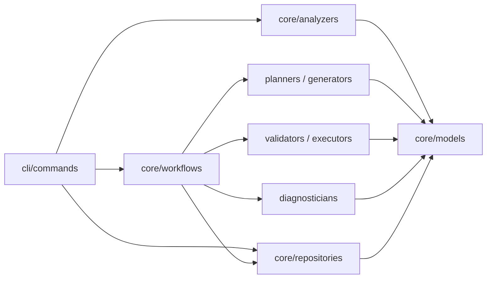
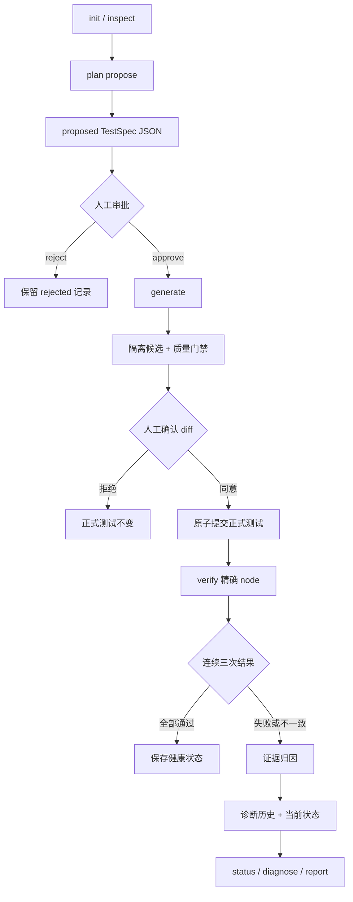

# test-assistant 项目结构

> 当前版本：`v0.4.0` 候选版
>
> 更新日期：2026-08-01
>
> 适用范围：当前仓库中的 Python/pytest 可信 CLI

本文描述当前代码，而不是未来路线图。历史构想位于 `docs/plans/`。

## 顶层结构

```text
test-assistant/
├── cli/                    Click 命令入口和参数/输出适配
├── core/                   与 CLI 解耦的领域模型和业务能力
├── tests/                  单元、契约、CLI 集成和端到端测试
├── docs/
│   ├── project-structure.md
│   ├── user-guide.md
│   └── plans/              历史设计、路线图和实施计划
├── pyproject.toml          包、依赖、命令入口和 pytest 配置
├── poetry.lock             锁定的依赖版本
└── README.md               项目概览和快速开始
```

安装包只包含 `cli` 和 `core`。Web、watch 和旧测试生成器不属于当前代码结构。

## CLI 层

```text
cli/
├── main.py                 注册受支持命令
└── commands/
    ├── init.py             创建 .autotest、配置和初始快照
    ├── inspect.py          展示分析、契约、变更和测试选择依据
    ├── plan.py             propose/list/show/approve/reject TestSpec
    ├── generate.py         生成候选、执行门禁、展示 diff、人工提交
    ├── verify.py           验证精确 pytest node 并触发诊断
    ├── run.py              执行基于快照的增量测试流程
    ├── status.py           展示最近一次验证健康状态
    ├── diagnose.py         解释已保存的 Diagnosis JSON
    └── report.py           生成最近诊断的 Markdown 报告
```

CLI 层只负责解析参数、调用 `core` 和呈现结果。领域判断、文件安全策略和持久化不应只存在于 CLI 中。

## Core 层

```text
core/
├── models/                 稳定领域对象、枚举和序列化契约
├── analyzers/              项目、快照、源码符号、契约和影响分析
├── planners/               从符号与契约规划 TestSpec
├── generators/             从已批准 TestSpec 生成候选测试源码
├── validators/             静态、导入、收集、Runner 和隔离门禁
├── executors/              pytest/Vitest 执行器及统一 ExecutionReport
├── diagnosticians/         预检、重复性判断和证据归因
├── repositories/           TestSpec、候选、诊断和验证状态持久化
├── workflows/              候选提交与验证诊断编排
├── graphs/                 现有增量运行 Graph
├── llm/                    LLMClient 适配
├── reporters.py            DiagnosisRecord → Markdown
└── utils.py                CLI 使用的项目根目录查找
```

### 关键模块职责

| 模块 | 主要职责 |
| --- | --- |
| `models/test_spec.py` | TestSpec、预期证据、审批状态和强度判断 |
| `models/diagnosis.py` | 五类诊断、置信度、证据、位置和建议动作 |
| `analyzers/source.py` | Python 符号、可测性、导入关系和测试索引 |
| `analyzers/contract.py` | docstring、类型提示、Schema 和已有测试证据 |
| `planners/test_spec.py` | 校验 LLM JSON 并构造 proposed TestSpec |
| `generators/test_spec.py` | 只允许 approved TestSpec 进入生成器 |
| `validators/python.py` | 候选测试门禁和副作用检查 |
| `workflows/candidate.py` | 候选生成、隔离验证、diff 和正式提交 |
| `workflows/verification.py` | 门禁、三次精确复跑、归因和记录保存 |
| `diagnosticians/attribution.py` | TestSpec、契约、门禁、位置和执行证据归因 |
| `repositories/candidate.py` | 候选隔离路径、摘要、diff 和并发安全提交 |
| `repositories/diagnosis.py` | 版本化诊断 JSON、原子写入和敏感信息脱敏 |
| `repositories/verification.py` | 最近一次健康/诊断状态，不删除诊断历史 |

## 依赖方向



`core/models` 不依赖 CLI。repositories 不负责业务审批；workflow 不直接解析 Click 参数。

## 端到端数据流



## 目标项目中的 `.autotest`

```text
.autotest/
├── config.yml                         目标项目配置
├── snapshot.json                      增量分析基线
├── plans/
│   └── spec-*.json                    版本化 TestSpec
├── candidates/
│   └── SPEC_ID/SOURCE_PATH/           隔离候选及 metadata
├── test_cases/unit/
│   └── SOURCE_PATH/TEST_FILENAME      人工确认后的正式测试
├── diagnoses/
│   ├── TIMESTAMP.json                 诊断历史
│   └── latest.json                    最近一次失败诊断
├── verification/
│   └── latest.json                    最近一次验证健康状态
└── reports/
    └── latest.md                      默认 Markdown 报告
```

候选文件和正式文件是两个不同区域。未经两阶段确认，候选不能进入 `test_cases/`。

## 必须保持的系统不变量

- proposed/rejected TestSpec 不能生成测试。
- 正式测试写入前必须通过门禁并由用户确认 diff。
- `verify` 只执行用户指定的精确 pytest node。
- `PRODUCT_DEFECT` 需要已批准强契约、通过的测试门禁和同环境稳定失败。
- 证据不足时返回 `INCONCLUSIVE`，不以高置信度猜测。
- 成功验证不删除历史诊断，但会更新当前健康状态。
- JSON 正式路径使用临时文件、flush、fsync 和原子 replace。
- 诊断持久化和报告必须脱敏。

## 测试对应关系

```text
tests/test_cli_end_to_end.py           完整 CLI 生命周期
tests/test_cli_plan_propose.py         TestSpec 提议入口
tests/test_cli_generate.py             审批、diff 与提交
tests/test_cli_verify.py               真实 pytest 三次验证
tests/test_candidate_workflow.py       候选 workflow
tests/test_verification_workflow.py    验证 workflow
tests/test_failure_attribution.py      证据归因决策表
tests/test_diagnosis_repository.py     持久化与脱敏报告
```

实现计划与历史决策参见：

- `docs/plans/2026-07-27-python-cli-trusted-loop-roadmap.md`
- `docs/plans/2026-08-01-end-to-end-cli-workflow.md`
